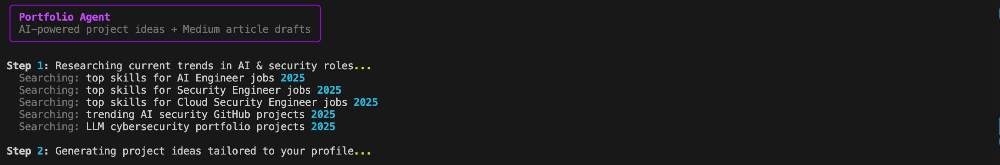
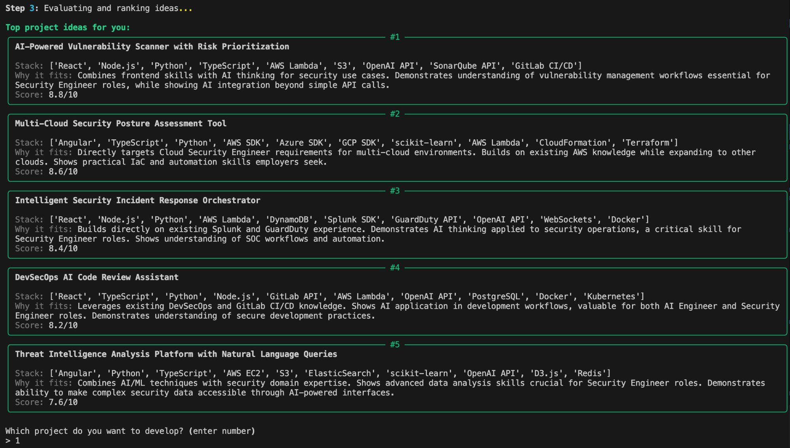
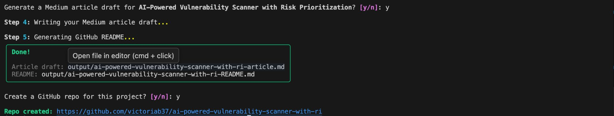

# Portfolio Agent 🤖

An AI-powered agent that researches current job market trends, generates tailored portfolio project ideas, scores and ranks them, then drafts a Medium article and GitHub README — all from the command line.

Built by [Victoria Browning](https://github.com/victoriab37) to showcase AI engineering and cybersecurity skills.

  

---

## What it does

1. **Researches** current hiring trends across your target roles using Tavily web search
2. **Generates** 5 project ideas tailored to your skills, certifications, and GitHub profile
3. **Evaluates & ranks** each idea by resume impact, technical depth, and learnability
4. **Writes** a full Medium article draft in your voice
5. **Scaffolds** a professional GitHub README
6. **Creates** the GitHub repo automatically

---

## How it works

### Step 1 — Trend research

The agent starts by running live Tavily searches across your target roles to understand what skills and projects employers are actually looking for right now.



It searches for:
- Top skills for each of your target roles (AI Engineer, Security Engineer, Cloud Security Engineer)
- Trending AI security projects on GitHub
- LLM + cybersecurity portfolio examples

This ensures every idea it generates is grounded in current market demand, not generic advice.

---

### Step 2 & 3 — Idea generation and ranking

Claude's `IdeatorAgent` takes your profile (skills, certifications, existing projects) and the trend research, then generates 5 project ideas. The `EvaluatorAgent` then scores each one across five dimensions: resume impact, technical depth, learnability, differentiation, and skill leverage.



Each idea includes:
- **Title** — a concrete, descriptive project name
- **Stack** — specific technologies drawn from your existing skills
- **Why it fits** — a one-sentence explanation of why this idea suits your background
- **Score** — a rating out of 10 based on hiring manager criteria

You then pick which project to develop by entering its number.

---

### Step 3 — Article + README generation and repo creation

After you select a project, the `WriterAgent` drafts a full Medium article in first person and a professional GitHub README. Both are saved to an `output/` folder. It then auto-creates the GitHub repo with the README already committed.



The output files are ready to use:
- **Article draft** — paste directly into Medium's editor
- **README** — automatically committed to the new GitHub repo

---

## Architecture

```
main.py
└── OrchestratorAgent
    ├── ResearchAgent     → Tavily web search (live job trend data)
    ├── IdeatorAgent      → Claude: generate 5 tailored project ideas
    ├── EvaluatorAgent    → Claude: score & rank by hiring criteria
    ├── WriterAgent       → Claude: draft article + README
    └── GitHubClient      → PyGithub: create repo + commit README
```

Each agent has a single responsibility and communicates through structured Python dicts. The orchestrator manages the pipeline and passes context between agents.

---


## Tech stack

| Tool | Purpose |
|---|---|
| [Anthropic Claude](https://anthropic.com) | LLM for idea generation, evaluation, and writing |
| [Tavily](https://tavily.com) | Web search for live job market research |
| [PyGithub](https://github.com/PyGithub/PyGithub) | GitHub repo creation and file commits |
| [Rich](https://github.com/Textualize/rich) | Terminal UI — panels, colors, prompts |
| [python-dotenv](https://github.com/theskumar/python-dotenv) | Secure API key management |

---

## Output

Each run saves two files to the `output/` folder:

```
output/
├── your-project-title-article.md   ← Medium blog post draft
└── your-project-title-README.md    ← GitHub README for the project
```

---


## Blog

Read about how I built this on Medium: [@victoriab37](https://medium.com/@victoriab37)
