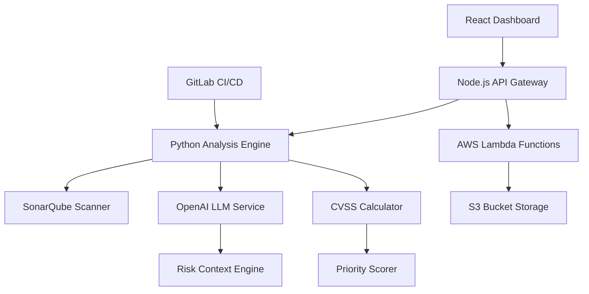

# AI-Powered Vulnerability Scanner with Risk Prioritization


An intelligent security platform that combines static code analysis with AI-powered risk assessment to prioritize vulnerabilities and generate actionable remediation strategies. This system transforms traditional vulnerability scanning into contextual security intelligence.

## 🏗️ Architecture Overview



**Key Components:**
- **Frontend**: React/TypeScript dashboard with vulnerability visualization
- **API Layer**: Node.js gateway handling authentication and data flow
- **Analysis Engine**: Python service orchestrating security scans and AI analysis
- **AI Integration**: OpenAI API for contextual risk assessment and remediation
- **Storage**: AWS S3 for scan results and historical data
- **CI/CD**: GitLab integration for automated security scanning

## 🚀 Quick Start

### Prerequisites
```bash
node >= 16.0.0
python >= 3.9
aws-cli configured
docker (optional)
```

### Installation

1. **Clone and setup**
```bash
git clone https://github.com/victoriab37/ai-vulnerability-scanner.git
cd ai-vulnerability-scanner
```

2. **Backend services**
```bash
# Python analysis engine
cd backend/analysis-engine
pip install -r requirements.txt

# Node.js API
cd ../api
npm install
```

3. **Frontend dashboard**
```bash
cd frontend
npm install
```

4. **Environment configuration**
```bash
cp .env.example .env
# Configure: OPENAI_API_KEY, AWS credentials, SonarQube token
```

### Running the Application

```bash
# Start all services
docker-compose up -d

# Or run individually:
npm run dev:api        # API Gateway (port 3001)
python run_scanner.py  # Analysis Engine (port 5000)
npm run dev:frontend   # React App (port 3000)
```

## 🎯 Usage

### 1. Repository Scanning
```bash
# CLI scanning
python scanner.py --repo https://github.com/user/repo --severity high

# Via Dashboard: Upload code or connect Git repository
```

### 2. AI-Enhanced Analysis
The system automatically:
- Runs static analysis via SonarQube integration
- Sends vulnerability data to OpenAI for contextual assessment
- Calculates CVSS scores with business context
- Generates prioritized remediation strategies

### 3. Dashboard Features
- **Risk Heatmap**: Visual vulnerability distribution across codebases
- **Trend Analysis**: Historical security posture tracking
- **AI Insights**: LLM-generated explanations and fix recommendations
- **Priority Queue**: Risk-ranked vulnerability backlog

## 🧠 Key Technical Concepts

### LLM Integration for Security Context
```python
# Prompt engineering for vulnerability assessment
def generate_security_context(vulnerability, codebase_info):
    prompt = f"""
    Analyze this security vulnerability:
    {vulnerability}
    
    Business Context: {codebase_info}
    
    Provide:
    1. Exploitability assessment
    2. Business impact severity
    3. Specific remediation steps
    """
    return openai_client.complete(prompt)
```

### CVSS Scoring with AI Enhancement
- Traditional CVSS base scores augmented with AI-derived temporal and environmental metrics
- Machine learning-based severity adjustment using historical breach data
- Context-aware scoring considering application architecture and data sensitivity

### Advanced Static Analysis Pipeline
- Multi-language AST parsing for deep code structure analysis
- Custom rule engine with AI-suggested security patterns
- Integration with SAST tools (SonarQube) and DAST capabilities
- Real-time scanning in CI/CD with quality gate enforcement

### Risk Prioritization Algorithm
```typescript
interface VulnerabilityScore {
  cvssBase: number;
  aiContextScore: number;
  businessImpact: 'LOW' | 'MEDIUM' | 'HIGH' | 'CRITICAL';
  exploitabilityIndex: number;
  priorityRank: number;
}
```

## 📊 Features Demonstrated

- ✅ **AI-Powered Security Intelligence**: LLM integration for contextual vulnerability analysis
- ✅ **Automated SAST Integration**: SonarQube API orchestration and custom rule management  
- ✅ **Dynamic Risk Scoring**: CVSS calculation with AI-enhanced business context
- ✅ **Real-time Security Dashboard**: React-based visualization with vulnerability trends
- ✅ **CI/CD Security Integration**: GitLab pipeline integration with quality gates
- ✅ **Cloud-Native Architecture**: AWS Lambda serverless functions with S3 storage
- ✅ **Enterprise Security Workflows**: Role-based access and compliance reporting

## 📝 Technical Deep Dive

Read the complete technical walkthrough and lessons learned in my Medium article: 
**[Building an AI-Powered Vulnerability Scanner: From Static Analysis to Intelligent Risk Assessment](https://medium.com/@victoriab37)**

---

*This project demonstrates enterprise-level security engineering capabilities, combining traditional SAST methodologies with cutting-edge AI to solve real-world application security challenges.*